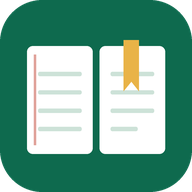

# BCS Prep Desk

A personal study tracker for the BCS (Bangladesh Civil Service) preliminary exam. It runs entirely in your browser, works offline, and can be installed on your laptop as an app.

## Features

- **Subjects & topics:** all 10 preliminary subjects with their marks (50th BCS distribution). You add topics from your own question analysis, with importance (1–5), which exams asked them, and notes. Bulk paste works too.
- **High-priority alerts:** topics with importance 4–5 are flagged whenever you open them, plan them, or they appear in today's plan.
- **Video tutorials:** track what you watch, when, and for how long, with a progress bar per video.
- **Study timer / Pomodoro:** stopwatch or 25/45/60/90-minute blocks. Every session is logged.
- **Spaced revision:** a topic marked Completed comes back for revision after 1, 3, 7, 15, 30, 60 and 90 days. "Hard" shortens the gap.
- **Flashcards:** Q&A cards per topic, with practice that puts your weak cards first.
- **Planner:** what to study, when, and from where. Plan a whole week at once, and carry missed plans forward.
- **Exams & mistakes:** negative-marking score calculator, subject-wise accuracy, and a mistake log linked to topics.
- **Analysis:** week-over-week comparison, study heatmap and streak, syllabus coverage by marks, time per subject, and weakest topics.
- Search (`/`), keyboard shortcuts (`?`), dark mode, desktop reminders.

## Your data

- All data is stored **only in your browser** on your device. Nothing is sent to GitHub or anywhere else.
- The code in this repository is public. Your study data is not.
- Turn on **Settings → Turn on auto-backup to a file** (Chrome/Edge) so every change is also saved to a JSON file on your computer.
- To move to another computer or browser, use **Export backup**, then **Import backup** there.

## Publish on GitHub Pages

1. Create a new **public** repository, for example `bcs-prep-desk`.
2. Upload every file in this folder to the root of the repository: `index.html`, `manifest.json`, `sw.js`, the `.png` icons and this `README.md`.
3. Go to **Settings → Pages → Build and deployment**, choose **Deploy from a branch**, then branch **main** and folder **/ (root)**, and click **Save**.
4. After a minute or two the app is live at `https://<your-username>.github.io/bcs-prep-desk/`.

## Install as an app

Open the link in Chrome or Edge and click the **Install** icon in the address bar, or **Install app** in the app's sidebar. It gets its own window and a Start-menu/desktop icon, and it keeps working without internet.

## Updating the app

1. Replace `index.html` in the repository with the new version.
2. Open `sw.js` and bump the version, for example `const VERSION = 'v1.0.1';`.
3. Commit. The installed app shows **"A new version is ready — Update now"** within an hour, or the next time you open it.

Your data is not affected by updates.
